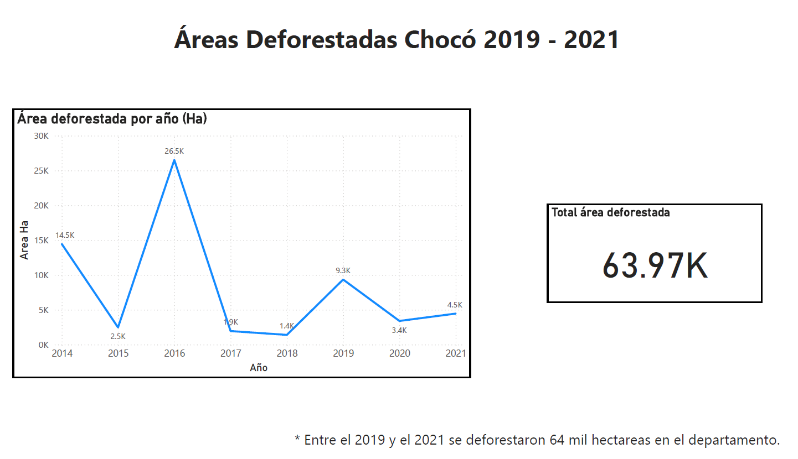
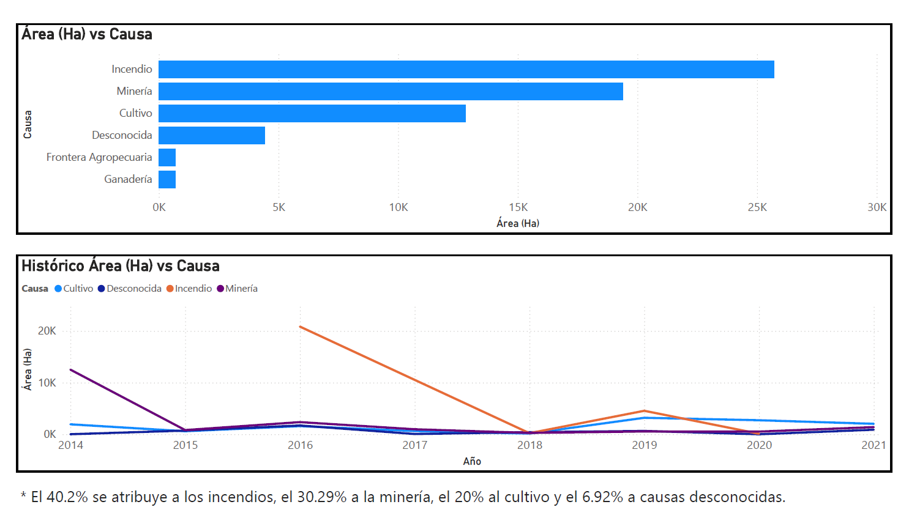
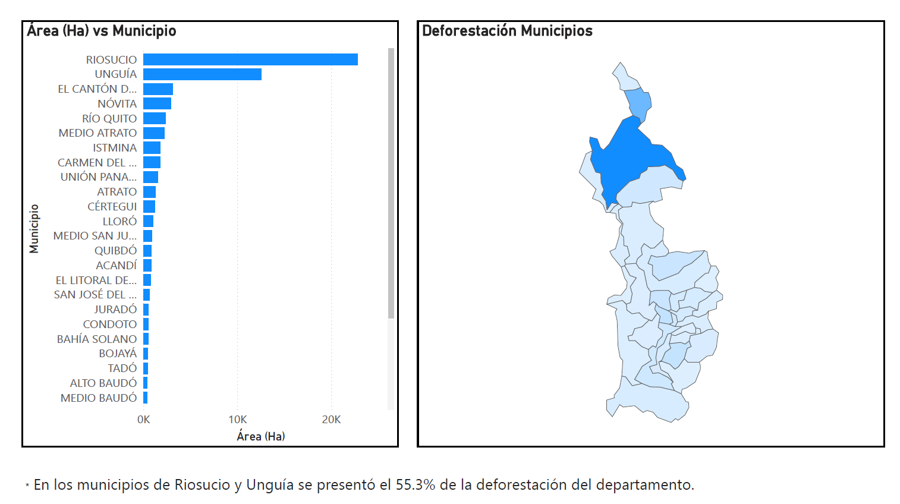

# Areas Deforestadas Departamento del Chocó 2019-2021
En el presente repositorio se realiza un breve análisis de los datos recopilados en el documento "AREAS DEFORESTADAS CHOCO" de los "datos abiertos" de la República de Colombia, el cual puede ser encontrado en el siguiente enlace: [Datos](https://www.datos.gov.co/Ambiente-y-Desarrollo-Sostenible/AREAS-DEFORESTADAS-CHOCO/iczg-dyt3/about_data)

## Área Deforestada

## Causas de deforestacíon

## Deforestación por Municipios

